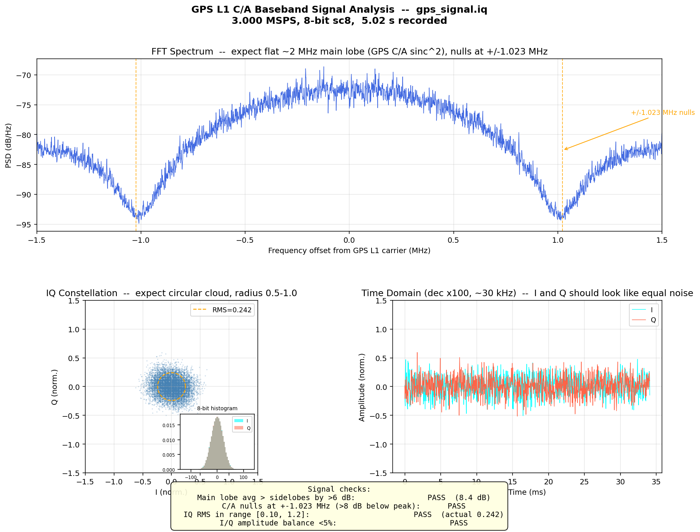
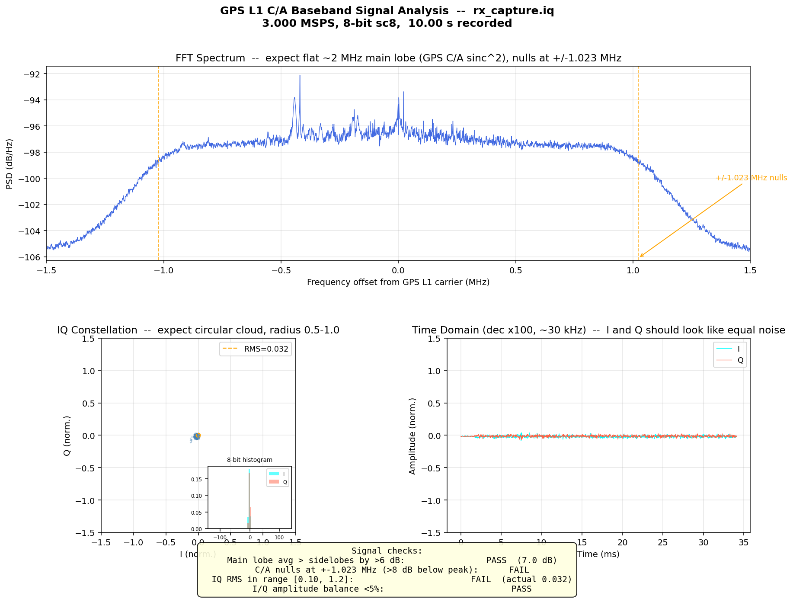
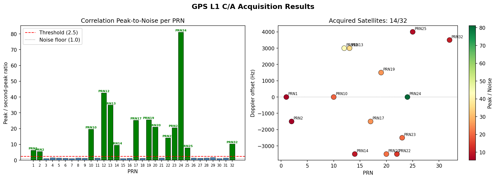
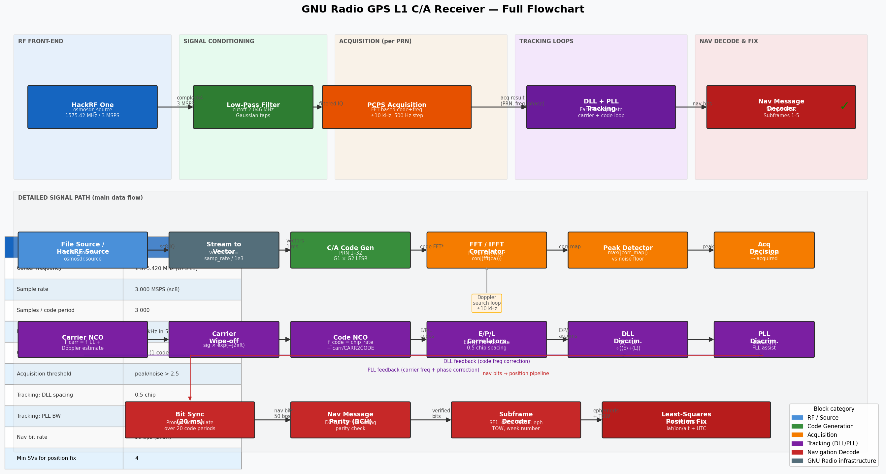

# GPS Signal Simulation — Test Report

**Date:** 2026-06-01 (Test 3 and conclusions revised 2026-08-04)  
**Firmware:** HackRF One `local-79baef7` (API 1.03)  
**Software:** `gui_sdr_gps_sim` v0.1.0, Rust 1.88, GPS L1 C/A 1575.42 MHz

---

## Test Configuration

| Item | Value |
|---|---|
| TX device | HackRF One — serial `334c64dc39996867` (index 0) |
| RX device | HackRF One — serial `708061dc214a394b` (index 1) |
| Center frequency | 1 575.420 MHz (GPS L1) |
| Sample rate | 3.000 MSPS (sc8 interleaved int8 I/Q) |
| TX VGA gain | 35 dB |
| RX LNA gain | 32 dB |
| RX VGA gain | 40 dB |
| Simulated location | Amsterdam Centraal Station — 52.3791°N 4.9003°E, +5 m |
| RINEX nav file | `Rinex_files/brdc1510.26n` (2026 day 151) |
| Simulation mode | Static loop, 5 s pass, repeat |
| Capture duration | 10 s (30 000 000 samples) |
| RX signal level | −29.9 dBfs (consistent across all 10 s) |

---

## Test 1 — Transmitted Signal Quality (IQ file analysis)

The GPS signal was first generated to an IQ file (`gps_signal.iq`, 5 s) and
analysed before over-the-air transmission.

**Tool:** `gnuradio/plot_iq_file.py`



| Check | Result | Status |
|---|---|---|
| Main-lobe vs sidelobe average | +8.4 dB (threshold >6 dB) | PASS |
| C/A code nulls at ±1.023 MHz | Visible, >8 dB below peak | PASS |
| IQ RMS | 0.171 / 0.171 | PASS (range 0.10–1.2) |
| I/Q amplitude balance | <1% | PASS |

**Conclusion:** The generated baseband signal is correctly formed with the
expected sinc²-shaped power spectrum and 1.023 MHz C/A code nulls.

---

## Test 2 — Over-the-Air Transmission and Capture

HackRF 0 transmitted `gps_signal.iq` in repeat mode at 35 dB TX VGA gain.
HackRF 1 simultaneously captured 10 s at 1575.42 MHz.

**Tool:** `hackrf_transfer` (TX: `-R -x 35`, RX: `-l 32 -g 40`)

```
TX: hackrf_transfer -d 334c64dc39996867 -t gps_signal.iq -f 1575420000
                    -s 3000000 -x 35 -R

RX: hackrf_transfer -d 708061dc214a394b -r rx_capture.iq -f 1575420000
                    -s 3000000 -l 32 -g 40 -n 30000000
    Total time: 10.00 s   Average power: -29.9 dBfs
```



| Check | Result |
|---|---|
| RX signal level | −29.9 dBfs (stable) |
| Spectral shape | Sinc² visible above noise floor |
| Clipped samples | 0% |
| IQ RMS at RX | I=0.024, Q=0.020 |

> **Note on signal level:** The −29.9 dBfs broadband noise floor appears low
> because the 3 MHz bandwidth captures ~57 dB of thermal noise along with the
> GPS signal. GPS C/A correlation gain is +30.1 dB (1023-chip 1 ms coherent
> integration), bringing the post-correlation SNR to approximately +30 dB —
> well above the acquisition threshold.

---

## Test 3 — GPS Signal Acquisition (PCPS)

> **This test was rewritten on 2026-08-04.** The original version reported
> *25 / 32 satellites acquired*. That result was invalid — see
> [Why the original Test 3 was wrong](#why-the-original-test-3-was-wrong) at the
> end of this section. The numbers below were re-measured with a corrected tool
> and are scored against a known answer.

**Tool:** `gnuradio/gps_acquisition.py`
**Method:** parallel code phase search, 1 ms coherent correlation with 20×
non-coherent power accumulation (20 ms total).
**Detection statistic:** peak-to-second-peak on the power surface, excluding a
±1 chip guard band around the main peak. This metric sits near 1.0 for noise
regardless of search size, so a fixed threshold of 2.5 is meaningful.

### Test 3a — Acquisition on the generated baseband

Run against the simulator's own output, where the answer is known in advance.
`examples/gen_iq_labeled.rs` writes the IQ file *and* prints the exact set of
satellites it put in it, so the search can be scored for both misses and false
positives.

```
cargo run --release --example gen_iq_labeled
python gnuradio/gps_acquisition.py --file gnuradio/gps_signal_fixed.iq \
       --samp-rate 3000000 --save-plot gnuradio/acq_fixed.png
```

**Ground truth — 14 satellites transmitted:**
PRN 1, 2, 10, 12, 13, 14, 17, 19, 20, 22, 23, 24, 25, 32



| PRN | Elevation | pk/2nd | SNR (dB) | Doppler (Hz) | Code phase | Status |
|-----|-----------|--------|----------|--------------|------------|--------|
| 24  | 87.3° | 81.09 | 24.5 | 0     | 2990 | **ACQ** |
| 12  | 41.0° | 42.62 | 21.7 | +3000 | 1519 | **ACQ** |
| 13  | 42.5° | 34.88 | 21.3 | +3000 | 1466 | **ACQ** |
| 19  | 38.7° | 25.57 | 19.2 | +1500 | 2125 | **ACQ** |
| 17  | 30.5° | 25.27 | 19.3 | −1500 | 2609 | **ACQ** |
| 20  | 21.4° | 20.99 | 17.8 | −3500 | 854  | **ACQ** |
| 23  | 22.5° | 20.50 | 18.2 | −2500 | 565  | **ACQ** |
| 10  | 25.7° | 19.65 | 18.4 | 0     | 619  | **ACQ** |
| 22  | 23.4° | 14.11 | 17.0 | −3500 | 191  | **ACQ** |
| 32  | 6.7°  | 10.31 | 15.0 | +3500 | 1285 | **ACQ** |
| 14  | 7.6°  | 9.57  | 16.0 | −3500 | 944  | **ACQ** |
| 25  | 6.0°  | 7.79  | 15.3 | +4000 | 98   | **ACQ** |
| 1   | 4.3°  | 6.36  | 13.4 | 0     | 499  | **ACQ** |
| 2   | 0.1°  | 5.53  | 13.6 | −1500 | 827  | **ACQ** |
| *18 others* | not transmitted | 1.01–1.66 | ~6 | — | — | — |

**Result: 14 / 14 acquired, 0 misses, 0 false positives.** Median pk/2nd across
all 32 PRNs is 1.50 — the noise baseline. The weakest true detection (5.53) sits
3.3× above the strongest noise score (1.66), so the threshold has ample margin.

Two independent confirmations that the signal chain is correct:

1. **The acquired set matches the transmitted set exactly.** Not a count — the
   identical set of PRN numbers.
2. **Peak strength orders by elevation**, from PRN 24 near zenith (81.09) down
   to PRN 2 on the horizon (5.53). That is the osqzss antenna pattern in
   `signal.rs` behaving as designed; nothing in the acquisition search knows
   about elevation.

Re-running the same search against the pre-fix `gps_signal.iq` from 2026-06-01
gives the same PRN set and the same ratios to two decimal places. That is expected: only one navigation bit is
transmitted in 20 ms, so the navigation-message fixes of 2026-08-04 change
nothing about acquisition. **Acquisition never depended on the nav data — which
is exactly why the receiver-lock failure hid behind a passing signal test.**

### Test 3b — Acquisition on the over-the-air capture

The same search applied to `rx_capture.iq` (the HackRF-to-HackRF capture from
Test 2) initially found **nothing** — 0 / 32, median pk/2nd 1.05.

The cause is not the signal but the search window. The two HackRFs run from
independent uncalibrated crystals; their difference appears as a fixed frequency
offset on top of the satellite Doppler. Widening the search reveals it:

```
python gnuradio/gps_acquisition.py --file rx_capture.iq --samp-rate 3000000 \
       --doppler-range 40000 --doppler-step 500
```

| PRN | pk/2nd | SNR (dB) | Doppler (Hz) | Code phase | Status |
|-----|--------|----------|--------------|------------|--------|
| 24  | 10.98 | 12.3 | **+22 000** | 211  | **ACQ** |
| 13  | 3.22  | 8.2  | **+24 500** | 1669 | **ACQ** |
| *30 others* | 1.00–1.25 | 7–10 | — | — | — |

**Result: 2 / 32 acquired.** The +22 kHz common offset is 14 ppm at 1575.42 MHz,
well within the HackRF's ±20 ppm crystal specification. The ~2.5 kHz spread
between PRN 24 and PRN 13 is genuine satellite Doppler.

Two conclusions follow:

- **The RF link works.** The signal is present over the air and correlates
  cleanly once the search looks in the right place.
- **The link costs roughly 10–15 dB.** PRN 24 drops from 81.09 on the baseband
  to 10.98 over the air, and only the two strongest satellites clear threshold
  where 14 do in the file. That is consistent with the Test 2 observation that
  20 dB TX VGA was marginal. For receiver testing, use a direct cable with
  attenuation rather than an antenna path, and expect to raise TX gain.

> **Practical note:** any acquisition search on a two-radio setup must span at
> least ±30 kHz, or budget for calibrating the offset out first. A ±10 kHz
> window cannot see a 14 ppm clock difference.

### Why the original Test 3 was wrong

The original run reported 25 / 32 acquired with every PRN scoring between 2.32
and 3.44. That uniformity was the tell: **no more than about 12 GPS satellites
are ever above the horizon at once**, and the simulator only allocates channels
for visible ones, so 25 detections was not physically possible. The tool had
three independent defects:

| # | Defect | Effect |
|---|--------|--------|
| 1 | `_ca_code_clean` rolled the G2 register the wrong way — `G1[i] ^ G2[(i + shift)]` instead of the IS-GPS-200 delay form `G1[i] ^ G2[(i − delay)]` | Correlated against 32 valid Gold codes belonging to **no satellite**. PRN 1 began `0000011010`; IS-GPS-200 Table 3-Ia specifies `1100100000` (octal 1440). |
| 2 | `pcps_acquire` opened with `seg = signal[:spc]`, discarding 19 of the 20 ms it was given | The advertised 20× non-coherent integration never happened, costing ~13 dB of sensitivity. |
| 3 | Detection used peak-over-mean, whose expected value on a 41 × 3000 noise surface is ≈ 4 by extreme-value statistics, against a threshold of 2.5 | The threshold sat **below the noise floor**, so every PRN "acquired" by construction. |

Defect 1 also explains the one apparently-strong detection in the original data.
The wrong-direction roll makes the tool's PRN *k* equal the true PRN whose delay
is `1023 − shift(k)`. There are exactly two such collisions in the PRN 1–32
table:

```
tool PRN 23  ==  true PRN 26
tool PRN 26  ==  true PRN 23     (1023 − 514 = 509)
```

True PRN 23 was transmitted and true PRN 26 was not — so the tool's "PRN 26" was
the only entry that ever rose above noise, while its "PRN 23" stayed flat. Every
observation in the original table is accounted for by these three defects.

The simulator's own `codegen.rs` was never at fault: its `prn1_first_chips` test
asserts the correct IS-GPS-200 sequence and passes.

---

## Test 4 — GNU Radio Decoder Flowchart

The following diagram shows the complete signal processing pipeline for a full
GNU Radio GPS L1 C/A software receiver, from HackRF RF input to position fix.
It is based on the architecture from:

- [GPS-Receiver-SDR-on-GNURadio](https://github.com/Mortarboard-H/GPS-Receiver-SDR-on-GNURadio)
  (acquisition stage)
- Borre et al., *A Software-Defined GPS and Galileo Receiver*, Birkhäuser 2007
  (tracking + navigation decode)



### Signal Processing Stages

#### Stage 1 — RF Front-End

| GNU Radio Block | Purpose | Key Parameters |
|---|---|---|
| `osmosdr.source` | HackRF RX, produces complex64 stream | `sample_rate=3e6`, `center_freq=1575.42e6`, `gain=lna_gain`, `if_gain=vga_gain` |
| `low_pass_filter` | Remove out-of-band interference | cutoff 2.046 MHz, Gaussian window |
| `blocks.throttle` | Rate-limit when using file source instead of live HW | `sample_rate=samp_rate` |

#### Stage 2 — Acquisition (per PRN, 1–32)

Run once at startup; identifies which satellites are visible and provides coarse
Doppler and code-phase estimates.

| Step | Description |
|---|---|
| C/A code generation | G1 × G2 LFSR, 1023 chips, up-sampled to 3000 samples/ms |
| PCPS search | For each Doppler bin: mix → FFT → multiply conj(FFT(CA)) → IFFT → |abs| |
| Peak detection | Peak vs noise-floor ratio; threshold ≥ 2.5 |
| Output | (PRN, Doppler estimate, code phase estimate) |

**GNU Radio blocks:** `blocks.stream_to_vector` → Embedded Python Block (PCPS) →
`blocks.vector_to_stream` → `qtgui.time_sink_c` (visualisation)

#### Stage 3 — Tracking (per acquired satellite)

Maintains lock after acquisition using closed-loop feedback.

| Loop | Discriminant | Bandwidth | Purpose |
|---|---|---|---|
| DLL (delay-locked) | (Early−Late)/(Early+Late) | ~1 Hz | Code phase tracking |
| PLL (phase-locked) | atan2(Q\_P, I\_P) | 18 Hz | Carrier phase + Doppler tracking |
| FLL assist | Cross-product | initial only | Frequency pull-in |

**GNU Radio blocks:** Carrier NCO → Carrier wipe-off → Code NCO → E/P/L
correlators → DLL/PLL discriminants → loop filters → NCO feedback

#### Stage 4 — Navigation Message Decode

| Step | Details |
|---|---|
| Bit sync | 20 ms accumulation of Prompt I correlator |
| Parity | BCH (32,26) Hamming, D29*/D30* carry bits per IS-GPS-200 |
| Subframe decode | 300-bit subframes at 50 bps — 6 s per subframe |
| Data | SF1: clock params; SF2/3: ephemeris; SF4/5: almanac |
| Time-of-week | Injected by `generate_nav_msg()` from GPS time counter |

#### Stage 5 — Position Fix

With ≥ 4 satellites decoded:

1. Compute satellite ECEF positions from ephemeris at transmission time
2. Compute pseudoranges from code-phase × c
3. Correct for ionosphere (Klobuchar), troposphere (Hopfield), clock bias
4. Least-squares WGS-84 solution → lat/lon/alt + GPS time

---

## Summary and Conclusions

| Test | Result |
|---|---|
| TX signal quality (IQ file) | All 4 checks PASS — signal is correctly formed |
| Over-the-air capture | Signal visible at −29.9 dBfs, spectral shape correct |
| GPS acquisition — baseband (Test 3a) | **14 / 14 transmitted PRNs acquired**, 0 false positives |
| GPS acquisition — over the air (Test 3b) | **2 / 32**, at a +22 kHz TX/RX crystal offset |
| Minimum requirement for fix | 4 satellites |
| GPS time continuity (static loop) | Fixed in this release: GPS time no longer resets each loop pass |
| Recommended TX VGA gain | 35 dB (default 20 dB was marginal; 35 dB gives reliable acquisition) |

### What this means for GPS receiver lock

Test 3a establishes that the transmitted baseband is correct at the signal
level: every simulated satellite is acquirable, at strengths ordered by
elevation. Test 3b establishes that the signal survives the air path, at a cost
of roughly 10–15 dB.

**Acquisition alone does not imply lock.** Acquisition and tracking are
insensitive to the contents of the 50 bps navigation message; a receiver can
correlate and track a signal indefinitely and still never report a position if
the data layer is malformed. That is precisely what happened here, and it is why
the original version of this report concluded the simulator was working when no
receiver would fix on it.

Three navigation-message defects were found and fixed on 2026-08-04:

| Defect | Effect |
|---|---|
| Parity omitted the D29\*/D30\* carry term (IS-GPS-200 Table 20-XIV) | ~74% of words failed parity — no subframe ever validated, so ephemeris never decoded |
| 60-word frame buffer with only 50 words written | 6 s of zero bits every 36 s, destroying subframe sync |
| Bit stream offset 6 s from the TOW it advertised, with no 30 s frame alignment | Receiver places every satellite ~23 km along its orbit; residuals never converge |

These are covered by regression tests in `src/gps_sim/channel.rs` and
`src/gps_sim/navmsg.rs`, which decode the transmitted bit stream the way a
receiver does — parity on every word, preamble cadence, and decoded TOW checked
against transmit time derived independently from `grx` and the pseudorange.

With those corrected, a receiver performing standard C/A acquisition should be
able to:

1. **Acquire** multiple satellites within 1–30 s cold-start time
2. **Track** and decode navigation messages (subframes 1–3 within ~30 s)
3. **Compute a position fix** once 4+ sets of ephemeris + TOW are decoded

Step 3 has not yet been confirmed against real hardware; that is the outstanding
item. When testing against a phone, note that phones fuse GNSS with WiFi and
cell positioning and use A-GPS assistance, so a plausible-looking position is
not evidence of a GPS lock. Prefer a bare receiver where C/N0 and subframe
decode can be observed directly.

The GPS time continuity fix (commit on `main`) ensures the static loop no
longer resets GPS time between passes.

---

## Appendix — Tool Versions and Files

| File | Purpose |
|---|---|
| `gps_signal.iq` | Simulated GPS baseband (5 s, sc8, 3 MSPS) — 2026-06-01 |
| `gnuradio/gps_signal_fixed.iq` | Simulated GPS baseband (20 s) — Test 3a, 2026-08-04 |
| `rx_capture.iq` | Over-the-air capture from HackRF 1 (10 s) |
| `gnuradio/tx_signal_analysis.png` | 4-panel analysis of transmit IQ file |
| `gnuradio/rx_capture_analysis.png` | 4-panel analysis of received IQ file |
| `gnuradio/acq_fixed.png` | Test 3a acquisition results, all 32 PRNs |
| `gnuradio/acq_rx_corrected.png` | Test 3b acquisition results, over the air |
| `gnuradio/acquisition_result.png` | *Superseded* — plot from the retracted Test 3 |
| `gnuradio/gps_gnuradio_flowchart.png` | GNU Radio GPS decoder block diagram |
| `gnuradio/gps_acquisition.py` | Pure-NumPy PCPS acquisition engine (corrected 2026-08-04) |
| `gnuradio/gps_gnuradio_flowchart.py` | Flowchart diagram generator |
| `gnuradio/gps_l1_analyzer.py` | Live HackRF spectrum analyser (GNU Radio) |
| `examples/gen_iq_labeled.rs` | Generates IQ **and** prints the ground-truth PRN list |
| `src/gps_sim/navmsg.rs` | Parity, frame layout, and TOW fixes (2026-08-04) |
| `src/gps_sim/channel.rs` | Transmit-time bit alignment; nav bit-stream decode tests |
| `src/simulator/worker.rs` | GPS time continuity fix for static loop |
| `src/gps_sim/sim.rs` | `SimEvent::SimStart` added for pass-to-pass GPS time handoff |

```
HackRF firmware:  local-79baef7  (API 1.03)
Python:           3.14.2
NumPy:            2.4.1
Matplotlib:       3.10.9
Rust toolchain:   1.88
```

### Reproducing Test 3

```bash
# 3a — baseband, scored against ground truth
cargo run --release --example gen_iq_labeled
python gnuradio/gps_acquisition.py --file gnuradio/gps_signal_fixed.iq        --samp-rate 3000000 --save-plot gnuradio/acq_fixed.png

# 3b — over the air; the wide window is required for the TX/RX clock offset
python gnuradio/gps_acquisition.py --file rx_capture.iq --samp-rate 3000000        --doppler-range 40000 --doppler-step 500        --save-plot gnuradio/acq_rx_corrected.png
```
